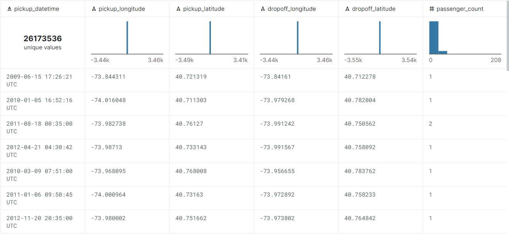

# new-york-taxi-fare-prediction

  

# Predicting Taxi Fares of New York City and deploying it on ServiceFoundry

  

## Useful Links

  

Taxi Fare Prediction model Deployment Video

  

[Link to Live Demo](https://taxi-fare-demo-vishank-betatest-ws.tfy-ctl-euwe1-develop.develop.truefoundry.tech/)

[Colab Notebook](https://drive.google.com/file/d/1WL8cnVmqsWxh9Ok-Ml5axAuxGfnZ1A9S/view?usp=sharing)
  

Blog with instructions on the run (Coming Soon)

  

## Description of the problem

  

The aim is the predict the taxi fares of New York with input features like pickup & dropoff co-ordinates, passenger count & the timestamp.

  

## Dataset Description

  

Here is link to the Kaggle Dataset: [https://www.kaggle.com/competitions/new-york-city-taxi-fare-prediction]()

  

Sample Data:

  



  

## Model Trained

  

We trained a XGBRegressor model. The model is trained using xgboost library and is deployed on the cloud using ServiceFoundry 🚀

  

## Instructions to deploy on ServiceFoundry

  

<details>

<summary><b><font size="5">Setting up servicefoundry</font></b></summary>

  

Install and setup servicefoundry on your computer.

  

```commandline
pip install servicefoundry

servicefoundry use server https://app.develop.truefoundry.tech

servicefoundry login
```
</details>

  

<details>

<summary><b><font  size="5">Training model</font></b></summary>

  

To deploy using the python API run the following command in terminal

  

1. Change working directory to train folder

  

```commandline

cd train

```

2. Create [workspace](https://docs.truefoundry.com/documentation/deploy/concepts/workspace) and [API key](https://docs.truefoundry.com/documentation/deploy/concepts/secrets) on the TrueFoundry platform

3. Replace the ``MLF_API_KEY`` value in the `train.yaml` file with the API Key found in [secrets tab](https://app.develop.truefoundry.tech/secrets) of your TrueFoundry account and it it in the `train.yaml` file <i>[(Instructions here)](https://docs.truefoundry.com/documentation/deploy/concepts/secrets#how-to-store-secrets-in-truefoundry)</i>

4. Copy the workspace fqn of the workspace that you want to use from the [workspace tab](https://app.develop.truefoundry.tech/workspaces) of TrueFoundry <i>[(Instructions here)](https://docs.truefoundry.com/documentation/deploy/concepts/workspace#copy-workspace-fqn-fully-qualified-name) and add it in the `train.yaml` file </i>

5. To deploy using python script:

  

```commandline

python train_deploy.py

```

  

To deploy using CLI:

  

```commandline

servicefoundry deploy --file train_deploy.yaml

```

6. Click on the dashboard link in the terminal

7. Click on the <b>"Trigger Job"</b> on the dashboard to run the training job

  

</details>

  

<details>

<summary><b><font  size="5">Deploying realtime inference</font></b></summary>

  

Note: <i>It is necessary to train a model before being able to deploy it as a service </i>

  

1. Change working directory to infer_realtime folder

  

```commandline

cd infer_realtime

```

2. Create [workspace](https://docs.truefoundry.com/documentation/deploy/concepts/workspace) and [API key](https://docs.truefoundry.com/documentation/deploy/concepts/secrets) on the TrueFoundry platform

3. Replace the ``MLF_API_KEY`` value in the infer_realtime_deploy.py file with the API Key found in [secrets tab](https://app.develop.truefoundry.tech/secrets) of your TrueFoundry account and add it in `infer.yaml` file <i>[(Instructions here)](https://docs.truefoundry.com/documentation/deploy/concepts/secrets#how-to-store-secrets-in-truefoundry)</i>

4. Copy the workspace_fqn of the workspace that you want to use from the [workspace tab](https://app.develop.truefoundry.tech/workspaces) of TrueFoundry <i>[(Instructions here)](https://docs.truefoundry.com/documentation/deploy/concepts/workspace#copy-workspace-fqn-fully-qualified-name) and add it in `infer.yaml` file </i>

5. Find the model_version_fqn of the model that you want to deploy from

  

* Go to experiments [tracking tab of TrueFoundry](https://app.develop.truefoundry.tech/mlfoundry)

* Click on the project name that you trained (<i>taxi-fare-train by default </i>)

* Click on models tab

* Click on the model name to the model trained to open the tab showing different versions of the model

* Copy the FQN of the latest version of the model

* Add the latest version in the `infer.yaml` file

6. To deploy using python script:

  

```commandline

python infer_deploy.py

```

  

To deploy using CLI:

  

```commandline

servicefoundry deploy --file infer/infer_deploy.yaml

```

7. Click on the dashboard link in the terminal to open the service deployment page with FastAPI EndPoint

  

</details>

  

<details>

<summary><b><font  size="5">Querying the deployed model</font></b></summary>

  

This can either be done via the [fastapi endpoint](https://taxi-fare-infer-vishank-betatest-ws.tfy-ctl-euwe1-develop.develop.truefoundry.tech/docs#/default/predict_predict_post) directly via browser.

  

You can also query with python script:

  

```python

request_url = "https://taxi-fare-infer-vishank-betatest-ws.tfy-ctl-euwe1-develop.develop.truefoundry.tech"

features= {

"pickup_datetime":"2015-01-27 13:08:24 UTC",

"pickup_latitude":40.7638053894043,

"pickup_longitude":-73.973320007324219,

"dropoff_latitude":40.74383544921875,

"dropoff_longitude":-73.981430053710938,

"passenger_count":3

}

  

predictions_list = requests.post(

url=urljoin(request_url, "/predict"), json=features

).json()

```

  

</details>

  

<details>

<summary><b><font  size="5">Deploying Demo </font></b></summary>

  

Note: <i>It is necessary to deploy live inference model before being able to deploy a demo </i>

  

1. Create [workspace](https://docs.truefoundry.com/documentation/deploy/concepts/workspace) and [API key](https://docs.truefoundry.com/documentation/deploy/concepts/secrets) on the TrueFoundry platform

2. Replace the ``MLF_API_KEY`` value in the infer_realtime_deploy.py file with the API Key found in [secrets tab](https://app.develop.truefoundry.tech/secrets) of your TrueFoundry account and add it in the `demo.yaml` file <i>[(Instructions here)](https://docs.truefoundry.com/documentation/deploy/concepts/secrets#how-to-store-secrets-in-truefoundry)</i>

3. Copy the workspace_fqn of the workspace that you want to use from the [workspace tab](https://app.develop.truefoundry.tech/workspaces) of TrueFoundry and add it in the `train.yaml` file <i>[(Instructions here)](https://docs.truefoundry.com/documentation/deploy/concepts/workspace#copy-workspace-fqn-fully-qualified-name)</i>

4. Copy the inference_server_url from:

  

* Go to deployment [tab of TrueFoundry](https://app.develop.truefoundry.tech/applications)

* Open the service that was deployment as live inference model <i>("taxi-fare-prediction" by default)</i>

* Copy the Endpoint link

5. To deploy using python script:

  

```commandline

python demo/demo_deploy.py

```

  

To deploy using CLI:

  

```commandline

servicefoundry deploy --file demo/demo_deploy.yaml

```

6. Click on the dashboard link in the terminal

7. Click on the <b>"Endpoint"</b> link on the dashboard to open the streamlit demo

  

</details>
